# 次世代シーケンスデータベース

Prepared for AJACS79 (AJACS十勝2)  
25 Sep 2019

大田達郎  
Tazro Ohta  
t.ohta@dbcls.rois.ac.jp

情報・システム研究機構 データサイエンス共同利用基盤施設 ライフサイエンス統合データベースセンター  
Database Center for Life Science (DBCLS), Joint Support-Center for Data Science Research, Research Organization of Information and Systems (ROIS)

----

これはバイオサイエンスデータベースセンター (NBDC) が主催する統合データベース講習会 AJACS79 (AJACS十勝2)「次世代シーケンスデータベース」の資料です。オンラインで閲覧することを想定しており、テキスト中にハイパーリンクが埋め込まれている箇所があります。また、随時アップデートをしていますので、最新版は https://github.com/AJACS-training/AJACS79 からご覧ください。この資料のライセンスは [CC-BY 4.0](https://creativecommons.org/licenses/by/4.0/deed.ja) です。  

講習会のお知らせとプログラム、各講習の資料へのリンクはこちら https://biosciencedbc.jp/event/ajacs/ajacs79.html です。

----

## 概要

本講習では、主に新型DNAシーケンサー (High-Throughput Sequencer, HTS) から得られる塩基配列データと、それに基づく生物学的データを公開しているデータベースの概要、およびデータベースからのデータの取得の手順を学びます。

----

## 講習の流れ

今回の講習では、以下の内容について説明します。

- 新型シーケンサーとは
  - 定義
  - どのように使われているか
  - 機器について
  - シーケンシング・アプリケーションについて
  -	得られるデータについて
-	新型シーケンサーのデータベースとは
  - データが登録されるまで
  - 一次データレポジトリ
  - 二次データを含むデータベース
-	データ解析についてのTips

----

## 新型シーケンサーとは

### 定義

講習のタイトルには「次世代シーケンサー」と書いていますが、現存するので「次世代」ではありません。「超並列シーケンス」、「新型シーケンス」とも呼ばれます。「次世代」は、いわゆる[バズワード](https://ja.wikipedia.org/wiki/バズワード)なので、明確な定義は存在しませんが、「サンガー法以降、2000年代中頃から登場した、新しいDNAシーケンス技術の総称」という理解で問題ありません。新型シーケンサーとして含まれるのは

- Illumina
- IonTorrent
- Roche 454
- PacBio RS
- SOLiD
- Oxford Nanopore

などのシーケンサーベンダー・ブランドによって提供する技術に代表されます。これまでに登場した新型シーケンサーの測定技術の詳細については、次の文献を参照してください。

[Goodwin, Sara, John D. McPherson, and W. Richard McCombie. "Coming of age: ten years of next-generation sequencing technologies." Nature Reviews Genetics 17.6 (2016): 333-351.](http://www.nature.com/nrg/journal/v17/n6/full/nrg.2016.49.html)

----

### どのように使われているか

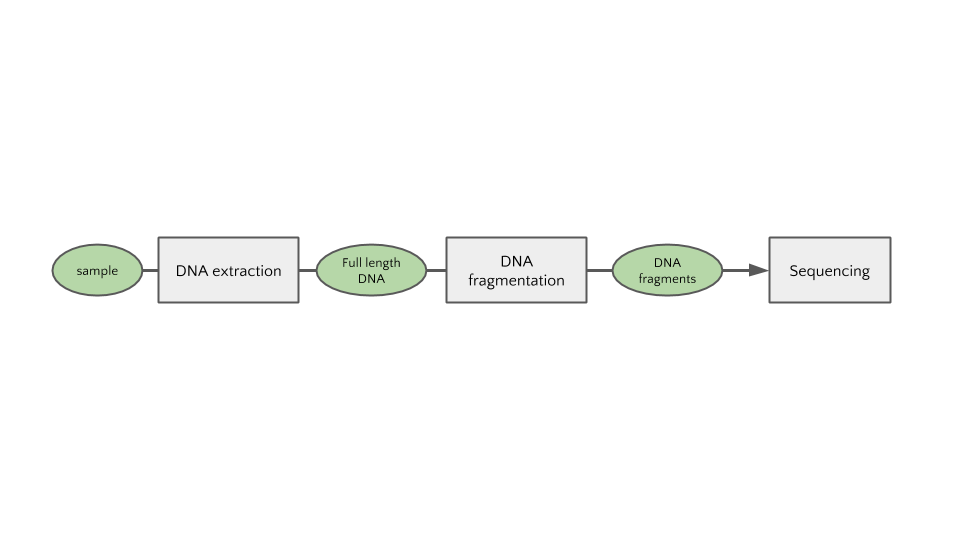

新型シーケンサはサンプルDNAを入力として処理し、DNA塩基配列をデータとして出力します。新型シーケンサはサンガー法のように長い塩基配列を読めない代わりに、大量の塩基配列を並列に読むことで高いスループットを実現します。ほとんどの場合、抽出されたDNAは断片化され、シーケンス反応用のプライマーを処理したのちにシーケンサーにかけられます。

シーケンサーから出力される一次データ (primary data, 生データ) はこの断片化された配列 (リード) の情報です。そのため、出力されたデータは、そのままでは生物学的な解釈ができません。そこで、新型シーケンサのデータを研究に利用するためには、リードを元の塩基配列に復元する必要があります。復元の方法には大きく2つの方法があり、出力されたリード情報のみを使う場合と、同じ生物種もしくは近縁種のゲノムDNAを参照する場合があります。前者を Assembly, 後者を Reference Alignment (mapping) と呼びます。

復元された塩基配列に対して、多型検出や発現量推定など、目的に応じた特徴抽出、注釈付けを行ったのち、サンプル間での統計検定を行うことで、研究データとしての解釈が可能になります。

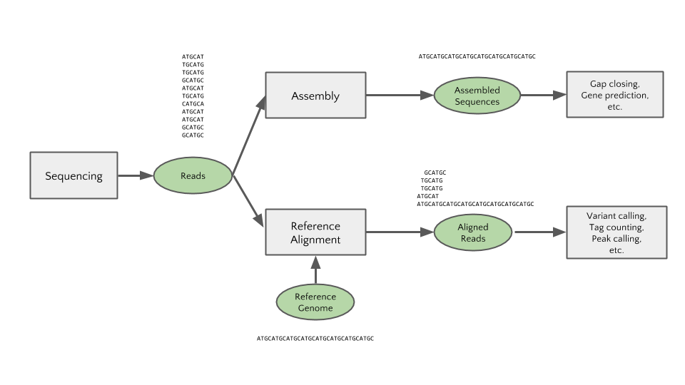

このように、一口に「新型シーケンサーを使う」と言っても目的に応じて解釈までに様々な異なるステップを経る必要があります。目的がはっきりしていなければデータが出ても何をしていいのか分からなくなってしまいますし、逆に、目的に応じて様々な使い方をすることができる機械であるとも言えます。

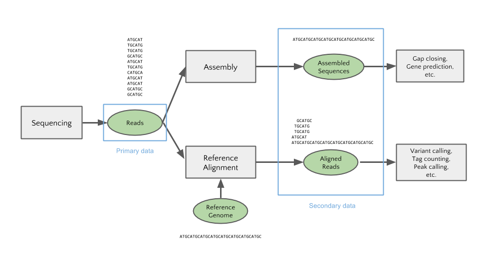
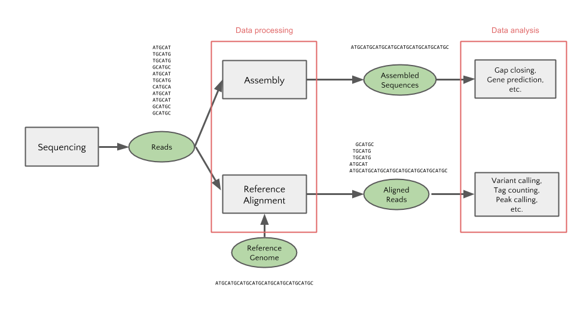

この講習では、シーケンサから出力された一次データに生物学的な注釈付を行うまでを「データ処理」、その後の統計処理などを「データ解析」と呼び分けています。人によっては両者をまとめて「データ解析」と呼ぶ場合もあります。ソフトウェアによってはデータ処理とデータ解析を一括で行うものもあります。データ処理をされる前、シーケンサーから得られた生のデータを「一次データ (primary data)」, データ処理、データ解析の過程で経られるデータを「二次データ」と呼びます。あくまでもこの講習において説明するための区別で、別の講習や書籍では異なる区分をする場合もあります。

サンプルからDNAを抽出するまではベンチワークです。単にゲノムDNAを抽出する場合もあれば、ゲノムDNAを処理して部分的に抽出したり、サンプルから抽出したRNAをDNAに逆転写したものをシーケンサーに入力として与えることもあります。詳しくは後述の「シーケンシング・アプリケーションについて」を参照してください。シーケンサーから出力されたデータから、プロットや表などの結果データを生成するまでの過程はコンピュータ上の操作が必要です。新型シーケンサーから得られるデータは一般にデータサイズが大きいため、従来のサンガーシーケンサーとは扱いが異なりますが、必要とされる計算機のスペックはサンプルの数、データのサイズ、サンプル生物種のゲノムサイズなどの要因によって異なります。

### シーケンサー機器について

新型シーケンサーから得られる塩基配列データのリードの長さや量は、機器と試薬のアップデートによって年々変化しています。また、コストあたりに得られるデータ量も変化しています。

上の図は2016年7月時点でのシーケンサー各社の公称スペックをプロットしたものです (引用: Developments in high throughput sequencing – July 2016 edition, https://flxlexblog.wordpress.com/2016/07/08/developments-in-high-throughput-sequencing-july-2016-edition/ )。多様なシーケンス機器が掲載されていますが、3年が経過した今、市場の競争は実質的に終結しつつあります。すなわち、短いリードでカバー率もしくはリード数を稼ぐ必要がある場合は Illumina 社のハイエンド機種を、長いリードを用いて短いリードでは測定が難しい部分の配列を決定する、あるいは新規にドラフトのゲノム配列を決定する場合には PacBio 社あるいは Oxford Nanopore 社の機種を使うことが一般的です。

新型シーケンサーのデータを得る、もしくはデータベースに登録されたデータを利用するためには、機器の違いを理解し、目的に応じて選択する必要があります。

### シーケンシング・アプリケーションについて

DNA抽出の方法を工夫することで、新型シーケンサーの高い並列度を活かした様々な分子の計測を行うことができます。前述の通り、全ゲノムDNAを与える場合 (Whole Genome Sequencing, WGS) やエクソン領域を増幅するキットを利用した Exome シーケンス、転写物をキャプチャして逆転写したDNAをシーケンスする RNA-Seq 、chromatin immunoprecipitation によって得られたDNA領域をシーケンスする ChIP-Seq などその種類は非常に多岐に渡ります。

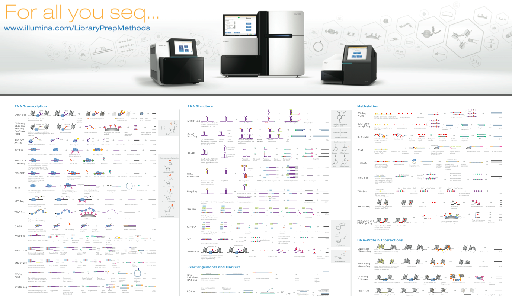

アプリケーションの詳細を知るためには、手法についての論文を当たることが最も確実です。次の資料は Illumina 社によってまとめられたものです。

[Sequencing Methods Review - A review of publications featuring Illumina® Technology](http://www.illumina.com/content/dam/illumina-marketing/documents/products/research_reviews/sequencing-methods-review.pdf)

それぞれのシーケンシング・アプリケーションにおける実験手技およびデータ処理・解析については、[次世代シークエンス解析スタンダード〜NGSのポテンシャルを活かしきるWET&DRY](http://www.amazon.co.jp/dp/4758101914/ref=cm_sw_r_tw_dp_40sGub0Q8C567)という書籍にもまとめられています。各シーケンス・アプリケーションがライブラリ調製から丁寧に解説してあり、非常に参考になります。新型シーケンサーについて日本語の情報が必要な場合はまずこの一冊を購入しましょう。

### 得られるデータについて

新型シーケンサのデータは一次データ (リード) から Assemble, Reference Alignment などのデータ処理、特徴抽出やアノテーションなどのデータ解析を経る中で、様々なファイルフォーマットで保存されます。ソフトウェアごとにどのフォーマットを入力/出力にするかが大抵の場合決まっているので、フォーマットを理解しておくことが重要です。

フォーマットには色々な種類があるため、手に入れたデータをどのように見ていいか分からない場合は、オンラインで公開されているファイルフォーマットの仕様を参照してください。ゲノムブラウザでお馴染みのUCSCに、データフォーマットについてまとめられたページがあり便利です。[https://genome.ucsc.edu/FAQ/FAQformat.html](https://genome.ucsc.edu/FAQ/FAQformat.html)

----

## 新型シーケンサーのデータベースとは

### データが登録されるまで

シーケンサーから得られたデータはデータ処理、データ解析を経て可視化され、可視化されたデータは論文あるいは何かしらのアウトプットの一部となることが一般的です。

しかし、現在ではほとんどの論文誌において、論文に用いた一次データ (つまりシーケンサから得られたデータ処理前のデータ) は *投稿前に* 公共データレポジトリに登録してアクセッション番号を取得する必要があります。

配列データを公共データレポジトリのサーバに送信し、サンプルやシーケンス実験についてのメタデータをガイドラインに従って記述する必要があります。つまり、発表された論文で使われたデータは (理想的には) その全てがオンラインで公開されていることになります。

配列データの登録は思っているよりも大変です。日本の登録窓口である [DDBJ](http://trace.ddbj.nig.ac.jp/dra/index.html) では専門のアノテーターが登録作業を補助してくれますが、数日かかることもあります。論文投稿前ではなく、データ解析や処理をする前の余裕のある時に登録しておきましょう。登録後はすぐに公開されるわけではなく、任意の期間 (原則2年間) プライベートにしておくことができます。

----

### 一次データレポジトリ

新型シーケンサーから得られたデータは個人を特定可能な情報を含むヒトデータとそれ以外に分けられ、データレポジトリに登録されます。

#### Open Access Data

個人特定可能な情報を含むヒトデータ以外のデータは全て Sequence Read Archive (SRA) への登録を指定されます。 SRA は International Nucleotide Sequence Database Collaboration (INSDC) によって運用されています。INSDCに参加しているのは米国の National Center for Biotechnology Information (NCBI), 欧州の European Bioinformatics Institute (EBI), 日本の DNA Data Bank of Japan (DDBJ) の3つの機関です。

3つの機関はそれぞれが独自にデータの登録・検索のシステムを公開・運用していますが、登録されたデータは3つの機関で交換され共有されています。

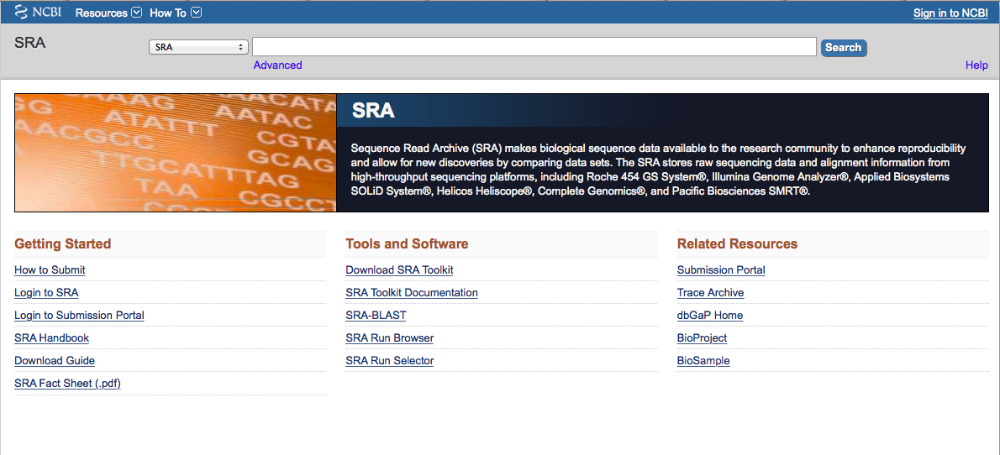

[NCBI SRA - www.ncbi.nlm.nih.gov/sra](http://www.ncbi.nlm.nih.gov/sra)

[EBI ENA - ebi.ac.uk/ena](http://ebi.ac.uk/ena)

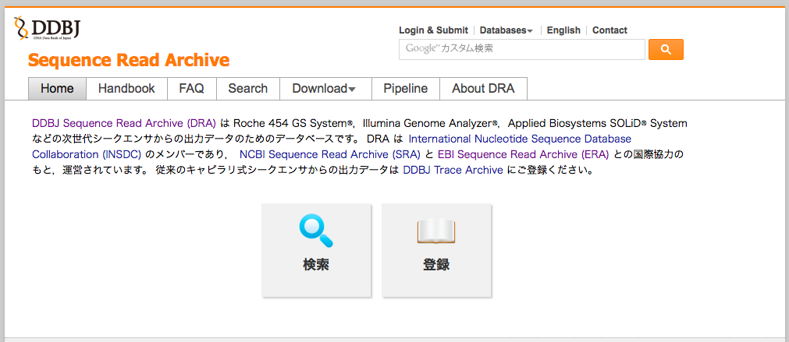

[DDBJ DRA - trace.ddbj.nig.ac.jp/dra](http://trace.ddbj.nig.ac.jp/dra)

##### データの登録の仕方と登録されたデータの見方

SRAにデータを登録するためには、データがどのようにレポジトリ内で整理され保管されているかを知る必要があります。データを探す場合にも、必要なデータを探すためにはどのようにデータのメタデータが記述されているかを知ることが重要です。以下が登録の手順を簡略化したものです。

1. 登録アカウントを作成してデータファイルをアップロードする
2. BioProject にプロジェクトの情報作成・登録する
3. BioSample にサンプルのレコードを作成・登録する
4. SRAにメタデータを登録する
  1. Experiment のレコードを登録する
  2. Run のレコードを登録する
5. データの検証をパスすれば登録完了、アクセッション番号が発行される

配列データはファイルとして SRA のサーバで (つまり NCBI, EBI, DDBJ いずれにも) 公開されており、ダウンロードすることができますが、その配列データがどのようなサンプルから得られたか、どのようなシーケンスをしたか、という情報、つまりメタデータは細かい単位に分けられ、それぞれにIDを振って管理されています。つまり、以下のようになります。

- プロジェクトの情報
  - ID: PRJDA38027
    - http://www.ncbi.nlm.nih.gov/bioproject/PRJDA38027
- サンプルの情報
  - ID: SAMD00016353
    - http://www.ncbi.nlm.nih.gov/biosample/SAMD00016353
- 実験の情報
  - ID: DRX000001
    - http://trace.ddbj.nig.ac.jp/DRASearch/experiment?acc=DRX000001
- Run の情報
  - ID: DRR000001
    - http://trace.ddbj.nig.ac.jp/DRASearch/run?acc=DRR000001

メタデータがこのように細かく分かれている理由は、個別のサンプルや個別の実験をレポジトリ側で管理しやすくするためですが、登録する際やデータを検索する際にはちょっと複雑です。複雑ですがめげずにやっていきましょう。

#### Controlled Access Data

配列データやメタデータにサンプルを提供した個人が特定可能な情報が含まれている場合には、データアクセスに許可が必要なデータ、すなわち controlled access データとなります。アクセスするための許可を得る方法は、登録されているデータレポジトリ、およびデータセットごとに異なります。また、 fastq データではなく変異情報のサマリーデータのみが登録される場合もあります。

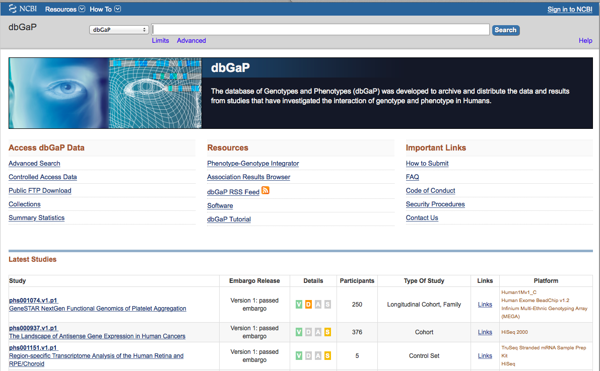

[NCBI dbGaP - www.ncbi.nlm.nih.gov/gap](https://www.ncbi.nlm.nih.gov/gap)

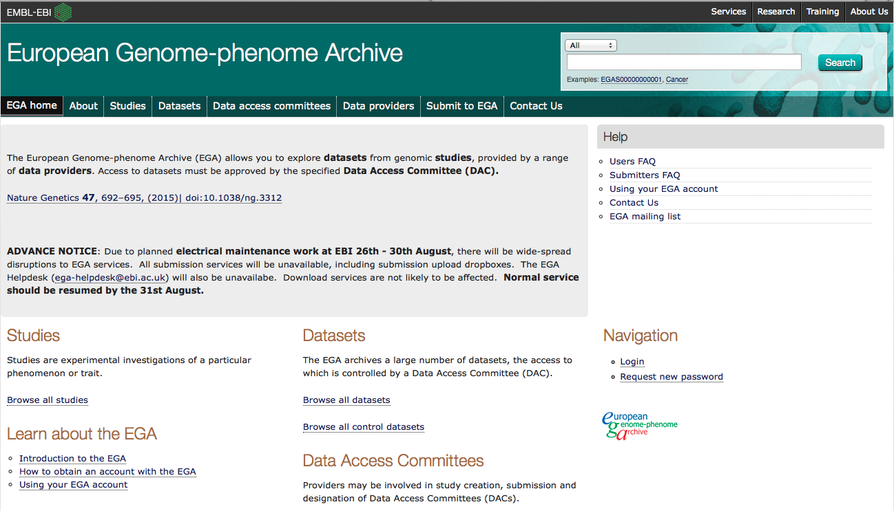

[EBI EGA - www.ebi.ac.uk/ega/](https://www.ebi.ac.uk/ega/)

[NCBI JGA - humandbs.biosciencedbc.jp](http://humandbs.biosciencedbc.jp)

##### Controlled Access Data にはどのようにアクセスするのか

データの検索はオンラインで可能ですが、実際のデータをダウンロードしたりそれを元に研究する場合には許可を得る必要があります。どこから許可を得るかは、レポジトリごとに異なり、以下のようになります。

- dbGaP の場合
  - National Institute of Health (NIH) の審査を受ける必要があります。
    - https://dbgap.ncbi.nlm.nih.gov/aa/wga.cgi?page=login
- EGA の場合
  - 利用したいデータごとに、データを寄託した組織・団体による data access-granting organisation (DAO) からの審査を受ける必要があります。
    - https://www.ebi.ac.uk/ega/about
- JGA の場合
  - NBDCヒトデータ審査委員会 の審査を受ける必要があります。
    - http://humandbs.biosciencedbc.jp/data-use

----

### 二次データを含むデータベース

SRAに登録されたデータを再利用したい場合には、データをダウンロードしたのち、データ処理・データ解析を行う必要があります。データ処理に用いられるソフトウェアの利用法を解説する書籍やウェブサイトも増え(後述します)、データ処理や解析の敷居は低くなっています。しかし、SRAに登録されたデータを予め処理したものや、それに基づく解析の結果を公開するデータベースも増えています。また、国際コンソーシアムなどによって行われる大型プロジェクトでは、プロジェクトのウェブサイトを通じて解析済みデータを公開している場合があります。

#### ChIP-Atlas

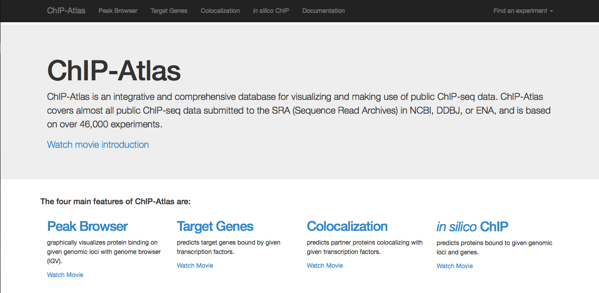

[ChIP-Atlas](http://chip-atlas.org) は 九州大医学部 発生再生研究室 と DBCLS によって開発され、九州大によって運用されているデータベースです。SRAで公開された ChIP-Seq, DNase-Seq のデータに定型処理を行い、その結果データに基いて様々な解析結果を公開しています。

- Reference:
  - Shinya Oki, Tazro Ohta, et al. ChIP‐Atlas: a data‐mining suite powered by full integration of public ChIP‐seq data. EMBO Rep. (2018) e46255; doi: [10.15252/embr.201846255](https://doi.org/10.1093/nar/gkw355)

#### wPGSA

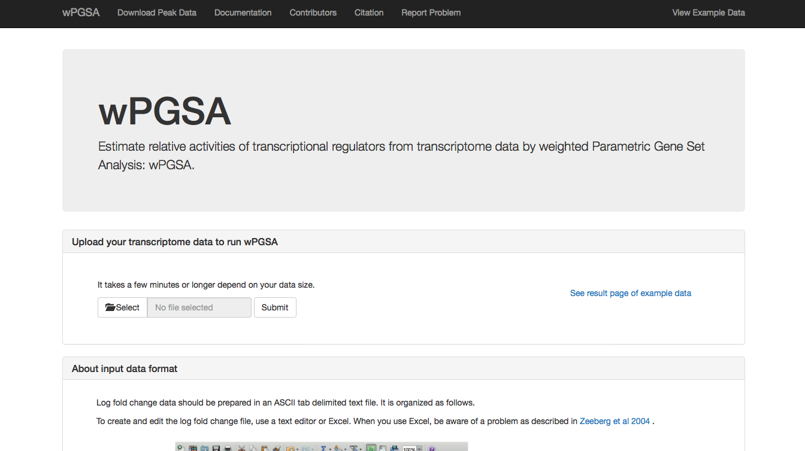

[wPGSA online](http://wpgsa.org) は 理化学研究所 医科学イノベーションハブ推進プログラム  川上英良博士と DBCLS のコラボレーションで開発・運用しているウェブサービスです。遺伝子発現データを入力として与えると、与えられた発現データに関与している転写因子の予測を行います。この手法では、SRAに登録されたChIP-Seqデータの再解析結果が利用されています。

- Reference:
  - Kawakami, E., Nakaoka, S., Ohta, T., & Kitano, H. (2016). Weighted enrichment method for prediction of transcription regulators from transcriptome and global chromatin immunoprecipitation data. Nucleic acids research, gkw355. [10.1093/nar/gkw355](https://doi.org/10.1093/nar/gkw355)

#### MicrobeDB.jp

[MicrobeDB.jp](http://microbedb.jp/) は統合データベースプロジェクト・微生物統合データベースによって開発・運用されているデータベースです。SRAで公開されている メタ16S、メタゲノム、メタトランスクリプトームなどのデータの解析データが蓄積されており、ブラウザ上で可視化することができます。

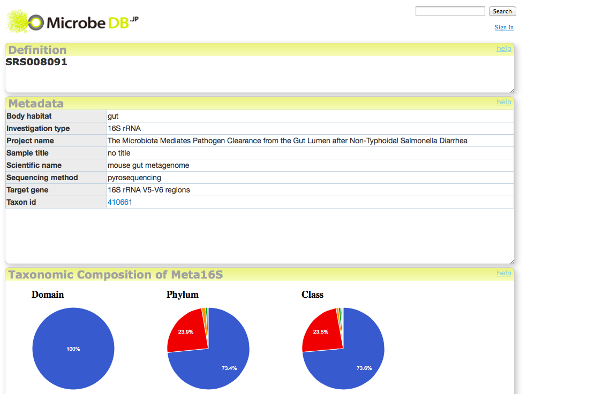

#### EBI RESTful RNA-seq Analysis API

EBI RNA-Seq Analysis API [http://www.ebi.ac.uk/fg/rnaseq/api/](http://www.ebi.ac.uk/fg/rnaseq/api/) は、SRAに登録されたもののうち、264生物種、265,000のシーケンスデータを解析した結果データを取得することができるサービスです。bigWig, bedGraph, FPKM, TPM などの情報を取ることができます。

API とは "Application Programming Interface" の略で、コンピューター・プログラムからアクセスされることを意図してデザインされたシステムであることを意味します。そのため、通常のウェブサイトのような綺麗な見た目や検索機能などはありません。しかし、APIのアクセスパターンを理解すれば、プログラムが書けなくてもウェブブラウザでデータを取得することができます。さらに、Shell Script や Ruby, Python などの比較的簡単なプログラミング言語を覚えれば、より効率よく処理を行うことができます。(興味のある人はトライしてみてください。たのしいよ！)

EBI RNA-Seq Analysis API の 仕様書は [http://www.ebi.ac.uk/fg/rnaseq/api/doc](http://www.ebi.ac.uk/fg/rnaseq/api/doc) にあります。EBI RNA-Seq Analysis API は EBI の遺伝子発現データベースである Expression Atlas の一部として開発されています。論文は以下を参照してください。

[Petryszak, Robert, et al. "Expression Atlas update—an integrated database of gene and protein expression in humans, animals and plants." Nucleic acids research (2015): gkv1045.](http://nar.oxfordjournals.org/content/44/D1/D746.full.pdf+html)

EBI RNA-Seq Analysis API は以下の4つの種類のデータを取得することができます。

- Analysis Results Per Run
- Analysis Results Per Study
- Sample Attributes Per Run
- Baseline Expression Per Gene - for Tissue, Cell Type, Developmental Stage, Sex and Strain

それぞれ、アクセスするURLのパターンによって欲しいデータを取得することができます。例として、"Baseline Expression Per Gene" 機能で遺伝子ごとのデータを取得してみましょう。以下のURLにウェブブラウザでアクセスしてみてください。

[http://www.ebi.ac.uk/fg/rnaseq/api/tsv/50/getExpression/homo_sapiens/POU5F1](http://www.ebi.ac.uk/fg/rnaseq/api/tsv/50/getExpression/homo_sapiens/POU5F1)

> Mac/Linuxなら「ターミナル」を開いて、  
curl "http://www.ebi.ac.uk/fg/rnaseq/api/tsv/50/getExpression/homo_sapiens/POU5F1"  
と打ち込んでみてください。

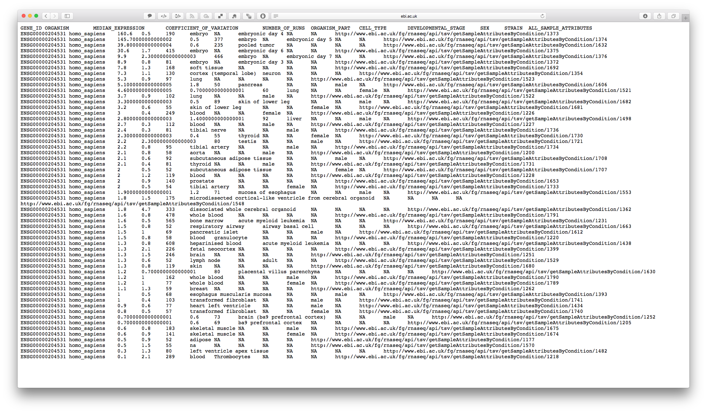

こんな結果が表示されます。画面に表示されたデータは tsv (tab separated values) です。これをそのままコピー・アンド・ペーストで Google Spreadsheet なんかに貼り付けて見るのがよいでしょう。自分のパソコンに保存したい場合は、画面上で右クリックして「名前を付けて保存」をするとよいです。この場合は "ebirnaseq.expression.50.homo_sapiens.POU5F1.tsv" なんて名前を付けてみてはどうでしょう。

このAPIでは取得したいデータの条件をURLの中に埋め込んでいきます。このURLに埋め込まれた条件は次の通りです。

- http://
  - ハイパーテキストトランスファープロトコルです。
- www.ebi.ac.uk/fg/rnaseq/api
  - EBI RNA-Seq Analysis API のサービスの base URL です。
- /tsv
 -  フォーマットを tsv に指定しています。 json にもできます。
- /50
  - minimum number of runs の値です。APIは条件に合致したエントリ(プロジェクト)を返しますが、エントリごとにRunの数が違います。この値は、表示するエントリをRun数で絞り込むことができます。50を指定することで「50回以上シーケンスRunのあるエントリを表示」という条件になります。
- /getExpression
  - 4つの機能のうちの Expression Per Gene のデータを取得することを示します。
- /homo_sapiens
  - 生物種を指定しています。
- /POU5F1
  - 遺伝子名を gene symbol で指定しています。

上のURLをちょっと変更することで別のデータを取得することができます。色々なデータを取得して比べてみたり、別のデータと組み合わせてみたりしてみてください。

- json 形式にしてみる
  - http://www.ebi.ac.uk/fg/rnaseq/api/json/50/getExpression/homo_sapiens/POU5F1
- Run数での絞り込みをやめてみる
  - http://www.ebi.ac.uk/fg/rnaseq/api/json/0/getExpression/homo_sapiens/POU5F1
- 別の遺伝子にしてみる
  - http://www.ebi.ac.uk/fg/rnaseq/api/json/50/getExpression/homo_sapiens/SOX2
- 別の生物種にしてみる
  - http://www.ebi.ac.uk/fg/rnaseq/api/json/50/getExpression/mus_musculus/pou5f1

表示されたデータの最後のカラムには "ALL_SAMPLE_ATTRIBUTES" というカラム名でURLが各行に埋め込まれています。これはサンプルの情報を取得するためのAPIのURLです。1つ選んでアクセスしてみましょう。

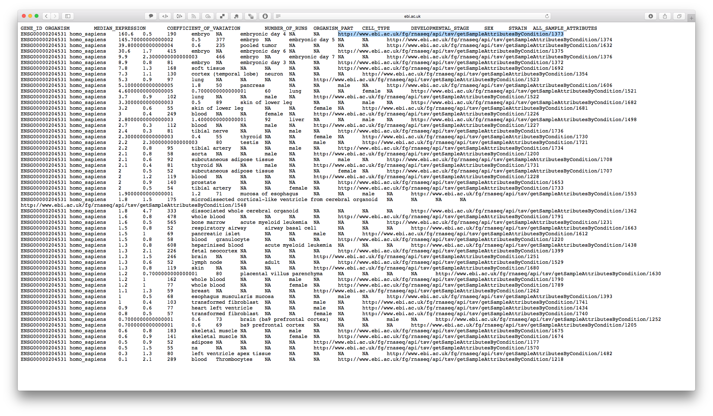

[http://www.ebi.ac.uk/fg/rnaseq/api/tsv/getSampleAttributesByCondition/1373](http://www.ebi.ac.uk/fg/rnaseq/api/tsv/getSampleAttributesByCondition/1373)

表示されたのはエントリに含まれるシーケンスRunとそのサンプルの情報です。STUDY ID と Run ID は SRA ID ですね。Run ID を使って、発現量のカウントを実行した後のデータが取れないかやってみましょう。 "Analysis Results Per Run" を使います。以下のURLにアクセスしてみてください。

[http://www.ebi.ac.uk/fg/rnaseq/api/tsv/70/getRun/ERR1041424](http://www.ebi.ac.uk/fg/rnaseq/api/tsv/70/getRun/ERR1041424)

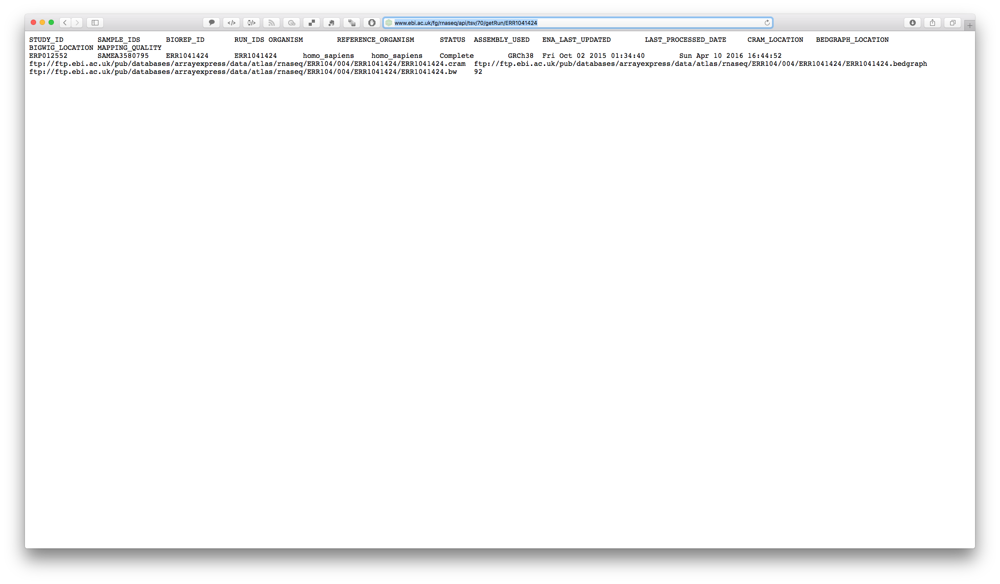

いくつかURLが表示されますが、 ".bw" で終わるftpのURLをコピーしましょう。 ".bw" は bigWig ファイルであることを示す拡張子です (bigWigフォーマットについては[こちら](https://genome.ucsc.edu/FAQ/FAQformat.html#format6.1))。ここではこのファイルを可視化するためにゲノムブラウザである [Integrative Genomics Viewer](http://software.broadinstitute.org/software/igv/) を使ってみます(デモ時のバージョンは2.3.81です)。

先ほどの getRun の結果のページのデータ中に、ゲノムのバージョンはGRCh38であると書いてあるので、 IGV でもゲノムは GRCh38 を選択します。ダウンロードしたての IGV には hg18 と hg19 しか含まれていないので、初回だけゲノムデータをダウンロードする必要があります。

IGV では URL を入力するとデータを取得し、表示してくれる機能がありますが、今回のデータはサイズが大きくタイムアウトエラー (ファイルの取得に時間がかかりすぎる) が出て怒られるので、 bigWig データを手元にダウンロードします。ブラウザで URL にアクセスするだけでデータのダウンロードが始まります。データのダウンロードが完了したら、 IGV のメニューから File > Load from File... を選択し、ダウンロードした bigWig ファイルを選択します。

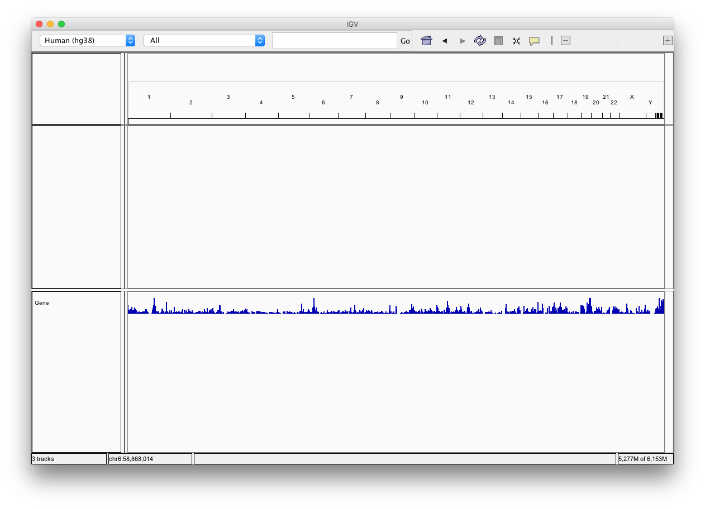

IGV を開いて GRCh38 を選択したところです。

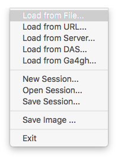

メニューから File > Load from File... を選んで

ダウンロードした .bw ファイルを選びます。

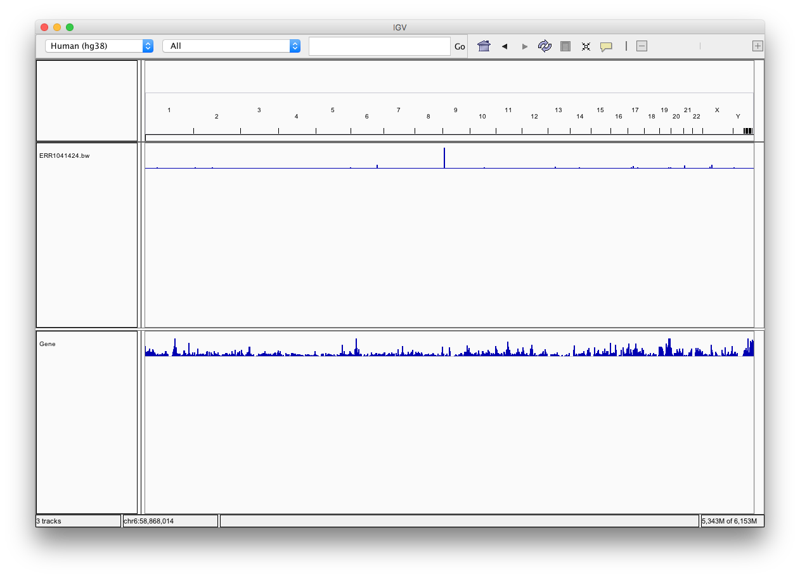

読み込まれました。

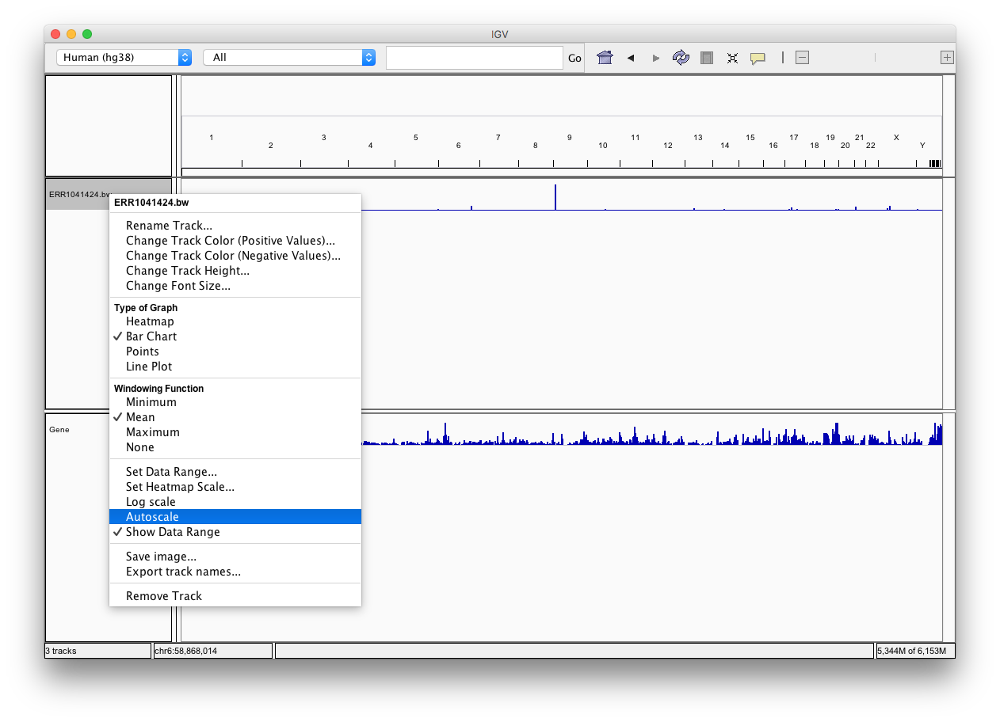

読み込まれたトラックで右クリックを押して "Auto Scale" を選択しておきます。

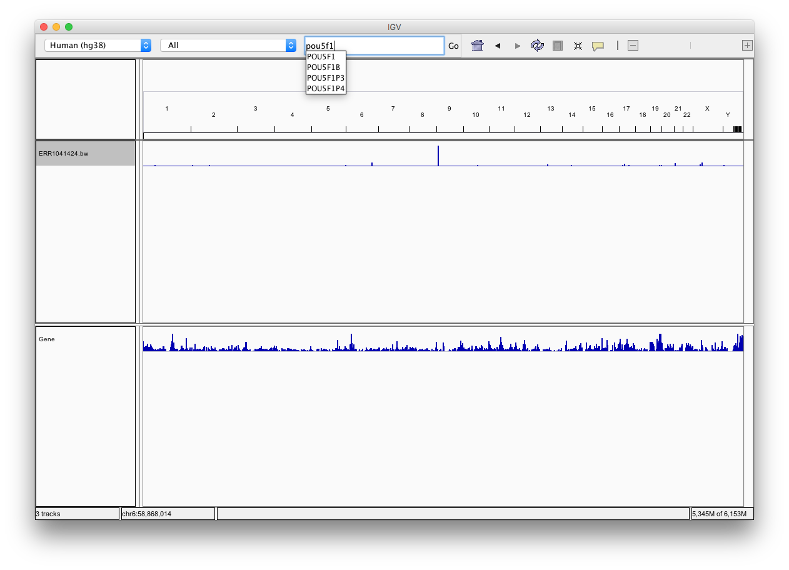

POU5F1 の様子を見てみましょう。検索ボックスに POU5F1 と入力します。

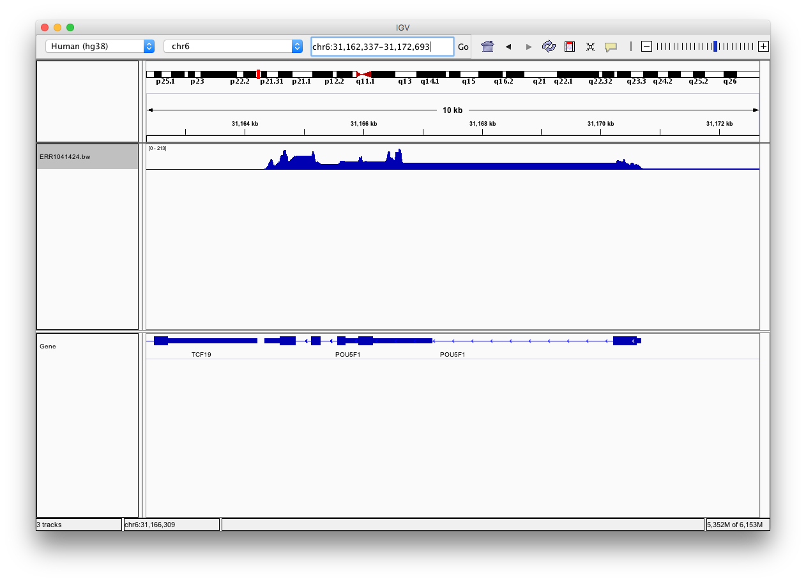

遺伝子発現のデータが表示されました！

このように、SRAに登録されている発現データを自分で解析しなくても、APIを使ってアクセスし、データをダウンロードすることで、手元で可視化したり、他のデータと比較したりすることができます。

----

## データ解析についてのTips

解析済みのデータの共有が進み簡単にデータを二次利用することができるようになっています。しかし、データによっては解析データが存在しなかったり、特定のソフトウェアの結果が必要な場合もあります。その場合は、SRAなどの一次データレポジトリからデータをダウンロードして自身で解析する必要があります。

コンピュータを用いたデータ解析に不慣れな方向けに、多くの教材や書籍、講習会などがあります。自分のデータを自分で解析してみたいという場合には、以下を参考にしてみてください。

- 統合データベース講習会
  - 講習資料と講演動画が [統合TV - togotv.dbcls.jp](http://togotv.dbcls.jp) から公開されています。
- NGSハンズオン講習会
  - http://biosciencedbc.jp/human/human-resources/workshop/h28-2
- [今日からはじめるDDBJ Read Annotation Pipeline](http://togotv.dbcls.jp/20100617.html)
- [データ解析プラットフォーム Galaxy の使い方](https://github.com/inutano/training/tree/master/ajacs52)
- 書籍: [次世代シークエンサーDRY解析教本 (細胞工学別冊)](https://www.amazon.co.jp/dp/4780909201)
- 国内のコミュニティ
  - [Pitagora Network](https://pitagora-network.org)
  - [Workflow Dev Meetup](https://github.com/manabuishii/workflow-meetup/wiki)
  - [Qiita - Bioinformatics](https://qiita.com/search?q=bioinformatics)
- 海外のチュートリアル
  - [DataCarpentry - Genomics](https://datacarpentry.org/lessons/#genomics-workshop)
  - [Galaxy Training Network](https://galaxyproject.org/teach/gtn/)

----

## 以上で終了です！

おつかれさまでした！
